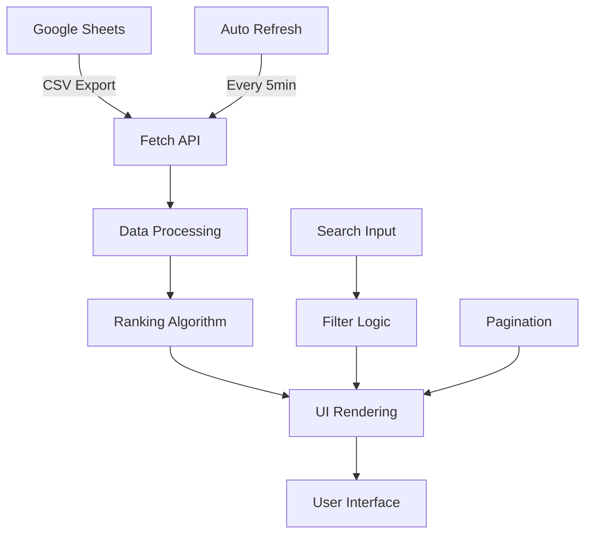

# 🏆 GenLayer Community Content Leaderboard

<div align="center">
  
  
  **A modern, real-time leaderboard for the GenLayer community showcasing member XP rankings**
  
  [](https://genlayer-leaderboard.vercel.app)
  [](https://github.com/fortunedwards/genlayer-leaderboard)
  [](https://vercel.com)
</div>

---

## ✨ Features

### 🎯 **Core Functionality**
- **Real-time Data Sync** - Automatically fetches data from Google Sheets every 5 minutes
- **Smart Update Detection** - Only updates timestamp when actual data changes occur
- **Responsive Design** - Optimized for desktop, tablet, and mobile devices
- **Search & Filter** - Instantly search through community members
- **Pagination** - Displays 50 members per page for optimal performance

### 🏅 **Ranking System**
- **Trophy Icons** - Special visual indicators for top 3 positions
  - 🥇 **1st Place**: Gold trophy with yellow highlight
  - 🥈 **2nd Place**: Silver trophy with gray highlight  
  - 🥉 **3rd Place**: Bronze trophy with orange highlight
- **Persistent Rankings** - Search results maintain original ranking positions
- **XP Display** - Formatted numbers with thousand separators

### 🎨 **Modern UI/UX**
- **Clean White Theme** - Professional appearance with excellent readability
- **Tailwind CSS** - Modern, responsive styling framework
- **Material Icons** - Consistent iconography throughout
- **Smooth Animations** - Hover effects and transitions
- **Avatar Generation** - Dynamic user initials in gradient circles

---

## 🚀 Live Demo

**Visit the live leaderboard:** [https://genlayer-leaderboard.vercel.app](https://genlayer-leaderboard.vercel.app)

---

## 📊 Data Source

The leaderboard connects to a Google Sheets document with the following structure:

### Sheet Format
| Column | Content | Starting Position |
|--------|---------|------------------|
| **A** | Member Names | A3 |
| **B** | Display Names | B4 |
| **C** | XP Values | C4 |

### Example Data
```
|   A   |      B      |   C   |
|-------|-------------|-------|
| Row 1 | Headers     |       |
| Row 2 | ...         |       |
| Row 3 | ...         |       |
| Row 4 | CryptoKing  | 15250 |
| Row 5 | NiftyQueen  | 14800 |
| Row 6 | BitVoyager  | 13550 |
```

---

## 🛠️ Technology Stack

<div align="center">

| Technology | Purpose | Version |
|------------|---------|----------|
|  | Structure | HTML5 |
|  | Styling | CSS3 |
|  | Functionality | ES6+ |
|  | UI Framework | 3.x |
|  | Data Source | API v4 |
|  | Deployment | Latest |

</div>

---

## 🏗️ Architecture



---

## 📱 Screenshots

<div align="center">
  
  
</div>

---

## 🚀 Quick Start

### Prerequisites
- A publicly accessible Google Sheets document
- Basic understanding of HTML/CSS (for customization)

### Deployment Options

#### Option 1: Vercel (Recommended)
1. **Fork this repository**
2. **Connect to Vercel**
   - Visit [vercel.com](https://vercel.com)
   - Import your forked repository
   - Deploy automatically

#### Option 2: Local Development
```bash
# Clone the repository
git clone https://github.com/fortunedwards/genlayer-leaderboard.git

# Navigate to project directory
cd genlayer-leaderboard

# Run local server (Python)
python server.py

# Or use any static file server
npx serve .
```

---

## ⚙️ Configuration

### Google Sheets Setup
1. **Create or access your Google Sheet**
2. **Make it publicly viewable**
   - Click "Share" → "Anyone with the link can view"
3. **Copy the Sheet ID** from the URL
   ```
   https://docs.google.com/spreadsheets/d/[SHEET_ID]/edit
   ```
4. **Update the configuration** in `index.html`:
   ```javascript
   const SHEET_ID = 'YOUR_SHEET_ID_HERE';
   ```

### Customization Options
- **Refresh Interval**: Modify the `setInterval` value (default: 5 minutes)
- **Items Per Page**: Change `membersPerPage` constant (default: 50)
- **Styling**: Customize Tailwind classes or add custom CSS
- **Branding**: Replace logo and update footer credits

---

## 🔧 Development

### File Structure
```
genlayer-leaderboard/
├── 📄 index.html          # Main application file
├── 🖼️ logo.png            # GenLayer logo
├── 🐍 server.py           # Local development server
├── 🦇 run.bat             # Windows batch file
├── 📚 README.md           # This file
└── 📋 upload-instructions.txt
```

### Key Functions
- `fetchLeaderboard()` - Retrieves data from Google Sheets
- `displayLeaderboard()` - Renders the leaderboard UI
- `filterMembers()` - Handles search functionality
- `updatePagination()` - Manages page navigation
- `generateDataHash()` - Detects data changes

---

## 🤝 Contributing

Contributions are welcome! Here's how you can help:

1. **🍴 Fork the repository**
2. **🌿 Create a feature branch**
   ```bash
   git checkout -b feature/amazing-feature
   ```
3. **💾 Commit your changes**
   ```bash
   git commit -m 'Add amazing feature'
   ```
4. **📤 Push to the branch**
   ```bash
   git push origin feature/amazing-feature
   ```
5. **🔄 Open a Pull Request**

### Development Guidelines
- Follow existing code style and conventions
- Test on multiple devices and browsers
- Update documentation for new features
- Ensure responsive design principles

---

## 📈 Performance

- **Load Time**: < 2 seconds on average connection
- **Data Refresh**: Every 5 minutes automatically
- **Mobile Optimized**: Responsive design for all screen sizes
- **Lightweight**: Minimal dependencies, fast rendering

---

## 🔒 Privacy & Security

- **No API Keys Required**: Uses public Google Sheets CSV export
- **Client-Side Only**: No server-side data processing
- **No User Data Collection**: Privacy-focused design
- **HTTPS Enabled**: Secure connection via Vercel

---

## 📄 License

This project is open source and available under the [MIT License](LICENSE).

---

## 👨💻 Author

**Fortune Edwards**
- Created for the GenLayer Community
- GitHub: [@fortunedwards](https://github.com/fortunedwards)

---

## 🙏 Acknowledgments

- **GenLayer Community** - For the inspiration and data
- **Tailwind CSS** - For the beautiful styling framework
- **Google Sheets** - For providing the data backend
- **Vercel** - For seamless deployment and hosting

---

<div align="center">
  <strong>Made with ❤️ for the GenLayer Community</strong>
  
  [](https://github.com/fortunedwards/genlayer-leaderboard)
</div>